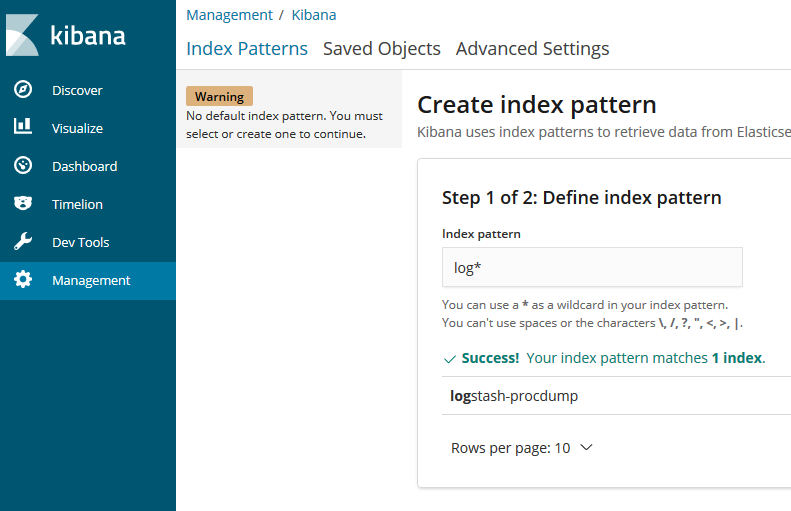
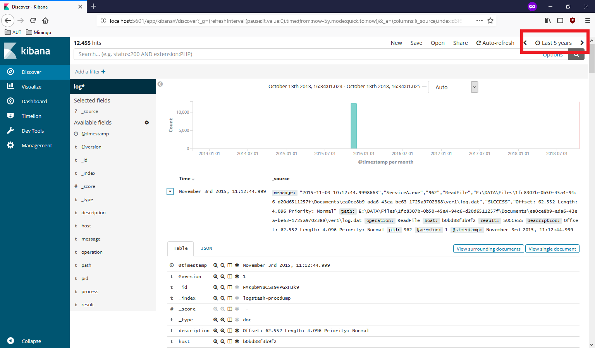
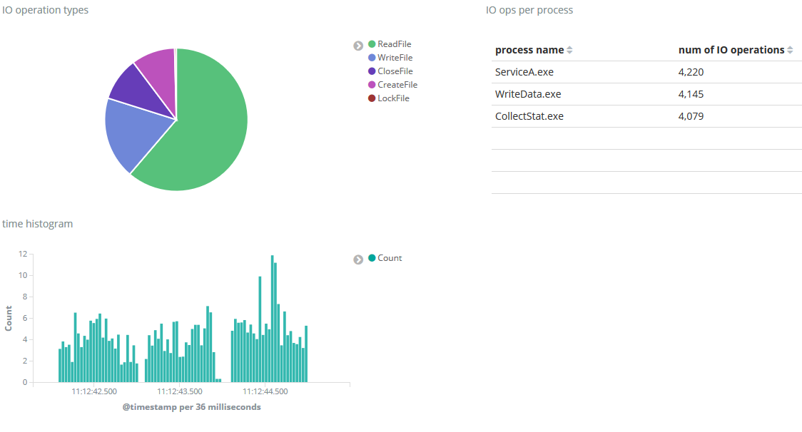

# Elasticsearch, Logstash, Kibana

The so-called ELK stack features Elasticsearch as database, Logstash as an ETL tool and Kibana as a web-based dashboard.

## Task

We have a text-based input file containing a log of IO accesses in a particular system. We are seeking to understand which process is the most IO heavy, and which files are used most.

### Steps

1. Create a Docker-based ELK cluster
1. Import the data using Logstash
1. Discover the data in Kibana
1. Write a few sample queries by hand
1. Create a dashboard in Kibana

### Pre-requisites

* Docker
* In Windows, Docker must be running in _Linux container mode_. You must also [share the drive](https://blogs.msdn.microsoft.com/stevelasker/2016/06/14/configuring-docker-for-windows-volumes/) where our files are, otherwise the volume mounts will not work.

## Create an ELK cluster in Docker and import the data using Logstash

We need three pieces of software in our system. We will use Docker to start them. The system is described by the docker-compose.yaml file.

### The compose file

Check the [docker-compose](./docker-compose.yml) file.

* Identify the services (the three apps for ELK).
* See how they are connected: through a bridge network.
* See how the services are configured: environment variables are passed to them (e.g. Kibana needs the URL of the Elasticsearch cluster).
* Observe the volume mounts in the Logstash container: we map folders from our host computer into the containers to pass the data and configuration.

### The Logstash pipeline configuration

The ETL process executed by Logstash is described by a text file; it is called the pipeline configuration.

Check the Logstash pipeline configuration file: [procdump-sample.conf](./logstash/pipeline/procdump-sample.conf).

The _input_ is the extraction phase. Logstash is plugin-based; we are using the [file](https://www.elastic.co/guide/en/logstash/current/plugins-inputs-file.html) input source plugin. We specify the path of the source file, and the position to start from. (Logstash is generally used to "stream" a log file, forwarding new entries. By specifying to start from the beginning, the entire file is processed.)

```
input {
  file {
    path => "/usr/share/sampledata/procdump.csv"
    start_position => "beginning"
  }
}
```

The _filter_ section corresponds to the transformation phase. The steps are applied one after the other. First, every line from the input file is parsed as csv and mapped to the specified columns. Then the date from one of _timestamp_ column is parsed from text are saved as real date in the _@timestamp_ column, which is the usual column name in Elasticsearch for time-based data.

```
filter {
  csv {
      separator => ","
      columns => ["timestamp","process","pid","operation","path","result","description"]
  }
  date {
    match => ["timestamp", "yyyy-MM-dd HH:mm:ss.SSSSSSS", "yyyy-MM-dd HH:mm:ss", "yyyy-MM-dd HH:mm"]
    remove_field => ["timestamp"]
    target => ["@timestamp"]
    timezone => "UTC"
  }
}
```

The _output_ is the load phase. Every record is forwarded to two outputs: Elasticsearch and the standard ourput (console).

```
output {
    elasticsearch {
        hosts => ["http://bidemo-elk-es:9200"]
        index => "logstash-procdump"
    }
    stdout {}
}
```

### Start the cluster

Issue the following command in the current directory.

```
docker-compose up
```

The cluster will take some time to start, then Logstash will start importing the content into Elasticsearch. This will be printed to the console too.

## Discover the data in Kibana

Kibana is a web-based dashboard. Open a browser and connect to http://localhost:5601.


### Index pattern

First we need to configure a so called _index pattern_. This is like a data schema. Although Elasticsearch is, as a No-SQL database, schema-less, Kibana extracts the schema of the data in order to provide meaningful display.

Click the _Discover_ link on the left, which will take us to the index configuration page.



Type "log*" as the index pattern definition, and then select the timestamp field. Although it is not necessary to have a time/date field, Kibana is most useful when the data has a time dimension.


Now our index pattern is ready. If the schema if the data changes in the future, this index pattern __must be updated__ in Kibana in the _Management_ page.

### Discover the data

Open the _Discover_ page. This page can be used to manually review the data, and drill-down into specific records. For this page to show any relevant data,use the time filter in the top right corner to show past data as well. The sample data is from 2015. (This time filter is present everywhere in Kibana, not just on this page.)



You see individual records here, and you can filter for specific data in the search field using [Lucene syntax](https://www.elastic.co/guide/en/kibana/current/lucene-query.html).

The discover page is useful in uderstanding the data. Look through a few records to see what attributes we have.

## Write a few sample queries by hand

Elasticsearch publishes a REST-like API. Every piece of software, even Kibana and Logstash uses this API. We could use a REST client, like Postman to send queries using the [query language](https://www.elastic.co/guide/en/elasticsearch/reference/current/_introducing_the_query_language.html) of Elasticsearch. But there is also a built-in tool in Kibana on the _Dev tools_ page.

### List the operations of the "process" with name "ServiceA.exe"

The query goes to the index created by Logstash with the name _logstash-procdump_, and for exact string matching we must use the keyword field and a term query.

```json
GET /logstash-procdump/_search
{
  "query": {
    "term": {
      "process.keyword": {
        "value": "ServiceA.exe"
      }
    }
  }
}
```

This query will let use know how many maching records it found (see in the reponse hits/total value); but it returns only 10 records. If we need more, we must specify _size_. But note, that there is no such query as "return all"; there is always a limit (server-side configuration value).

```json
GET /logstash-procdump/_search
{
  "query": {
    "term": {
      "process.keyword": {
        "value": "ServiceA.exe"
      }
    }
  },
  "size": 100
}
```

### Number of request per process

Elasticsearch is more than able to serve CRUD requests, but its true power is aggregations.

The [terms aggreation](https://www.elastic.co/guide/en/elasticsearch/reference/6.4/search-aggregations-bucket-terms-aggregation.html) groups the records according to the specified field. Asking for _size: 0_ means we actually do not want any records, just the result of the aggregation.

```json
GET /logstash-procdump/_search
{
  "aggs": {
    "perproc": {
      "terms": {
        "field": "process.keyword",
        "size": 10
      }
    }
  },
  "size": 0
}
```

### Most frequently accessed files of process "ServiceA.exe"

We can combine a filter ("query") and an aggregation to get the top 3 buckets of the terms aggregation.

```json
GET /logstash-procdump/_search
{
  "query":
  {
    "term": {
      "process.keyword": {
        "value": "ServiceA.exe"
      }
    }
  },
  "aggs": {
    "perproc": {
      "terms": {
        "field": "path.keyword",
        "order" : { "_count" : "desc" },
        "size": 3
      }
    }
  },
  "size": 0
}
```

## Create a dashboard in Kibana

We can create a dashboard ourself using Kibana, and export it later in json format. Let's import the _kibana-export.json_ file. Go to the _Management_ page, follow the _Saved objects_ link and use the _Import_ command. During the import you will need to select the _index pattern_ created before to use as the data source. After the import succeeds, go to the _Dashboards_ page and open the _procdump dashboard_. (If you see no data, use the time range filter in the top right corner.)



The pie chart shows the distribution of the types of IO operations; the table to the right lists the processes and the number of related IO ops; and the date histogram shows the time distribution of the data.

The diagrams are all interactive. You can select a range on the date histogram to filter for a time range; similarly, you can click a slice in the pie chart to filter for a particular operation type.

To see how the diagrams are build, go to the _Visualization_ page, and open the _IO operation types_ element.


The right side shows the preview of the visualization. On the left, without having to write Elasticsearch queries, we can select the type of aggregation to use (_count_ is used to show the number of IO operations), and the categories, which are the buckets (slices of the pie) split on the _operation.keyword_ column.

You can check the actual query sent to Elasticsearch using the _Inspect_ link at the top.

```json
{
  "aggs": {
    "2": {
      "terms": {
        "field": "operation.keyword",
        "size": 5,
        "order": {
          "_count": "desc"
        }
      }
    }
  },
  ...
  "query": {
    "bool": {
      "must": [
        {
          "range": {
            "@timestamp": {
              "gte": 1446545561791,
              "lte": 1446545565490,
              "format": "epoch_millis"
            }
          }
        }
      ]
    }
  }
}
```

The "aggs" part asks for a terms aggregation on the _operation.keyword_ field, meaning that the items are aggregated by the value, and only the top 5 buckets are returned. The "query" part filters the records by date according to the selected time range.

And the response, from which the diagram is built:

```json
{
  "took": 6,
  "timed_out": false,
  "_shards": {
    "total": 5,
    "successful": 5,
    "skipped": 0,
    "failed": 0
  },
  "hits": {
    "total": 12444,
    "max_score": 0,
    "hits": []
  },
  "aggregations": {
    "2": {
      "doc_count_error_upper_bound": 0,
      "sum_other_doc_count": 0,
      "buckets": [
        {
          "key": "ReadFile",
          "doc_count": 7623
        },
        {
          "key": "WriteFile",
          "doc_count": 2316
        },
        {
          "key": "CloseFile",
          "doc_count": 1229
        },
        {
          "key": "CreateFile",
          "doc_count": 1228
        },
        {
          "key": "LockFile",
          "doc_count": 48
        }
      ]
    }
  },
  "status": 200
}
```

The "hits" part contains the number of matched records. The "aggregations" holds the aggregated value: each item is a bucket with the name, and the number of elements in that bucket.

## Shutdown

To stop the Docker containers, press CTRL-C in the console. Will not delete the containers; you can restart them without losing the data with the same command we used to start them. To discard the containers, use

```
docker-compose rm
```